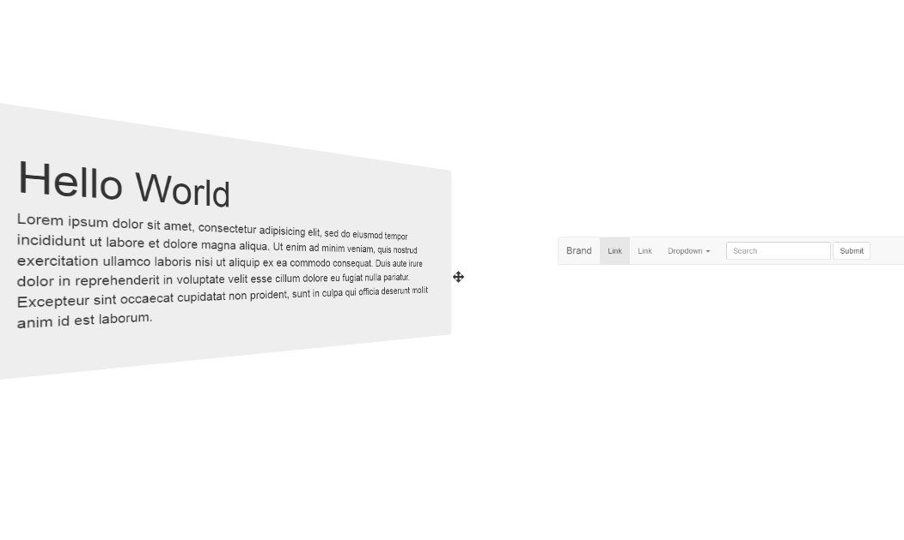

# Threejs-htmlRenderer
Render html elements in 3d environment.




## Requirement
You must include in your html jQuery, three.js and the plugin CSS3DRenderer ([link](http://threejs.org/examples/js/renderers/CSS3DRenderer.js)).

## How to install
```terminal
npm install --save threejs-htmlRenderer
```
Include in your .html this library after jQuery and three.js.

## How it works
Declare an element with id `html3DView` and another with id `view`. In `#html3DView`, compose your html elements with as parent the class name `page`. You can set positions & rotations by attributes `data-position-(x|y|z)` and `data-rotation-(x|y|z)`:
```html
<!DOCTYPE html>
<html>
  <head>
    <meta charset="utf-8">
    <title>Example</title>
  </head>
  <body>
    <div id="html3DView" style="display: none;">
      <div class="page" data-position-z="-180" data-rotation-y="3.14159">
        <h1>Hello World</h1>
      </div>
    </div>
    <div id="view"></div>
  </body>
</html>
```

In your `app.js` in the initalize method, call HtmlRenderer and pass camera object:
```js
var html3d = new HtmlRenderer();

function init() {
  ...
  html3d.init(camera);
}
```
And run the `render` method in your animate method:
```js
function animate() {
  ...
  html3d.render();
}
```
